# Execution Plan (Inception / Workflow Planning ステージ成果物)

> **作成日**: 2026-05-07T14:43:10Z
> **状態**: Draft (完了承認待ち)
> **基底ドキュメント**:
> - `aidlc-docs/inception/requirements/requirements.md` (FR-01〜11 / NFR / R1〜R14 / Extension Configuration / Q1〜Q5 回答)
> - `aidlc-docs/inception/user-stories/user-stories.md` (全 18 ストーリー / AC / 持ち越し 3 判断)
> - `aidlc-docs/inception/user-stories/personas.md` (P1 主 / P2 想定外)
> - `aidlc-docs/inception/plans/user-stories-assessment.md` (User Stories 実行根拠)
> **対応ルール**: `.aidlc-rule-details/inception/workflow-planning.md` Step 7

---

## 1. Detailed Analysis Summary

### 1.1 Project Type と Scope

| 観点 | 判定 |
|---|---|
| Project Type | **Greenfield** (既存コード無し / Mob Elaboration 確定版 2 ファイルあり) |
| Transformation Scope | **N/A** (Brownfield 専用 / 既存システム無し) |
| Cross-Package Impact | **N/A** (Brownfield 専用) |
| Module Coordination | **N/A** (まだ単一プロジェクト構成) |
| Initial Complexity | **Moderate〜Complex** (LLM プロンプト設計 + ヘルスケア API 連携 + 迷惑リスク判定 + 動的トーンシフト) |
| Depth Selected | **Standard** (Mob Elaboration 済みのため Comprehensive は不要 / Inception 成果物が外部ステークホルダー向けに提出されるため Minimal では不足) |

### 1.2 Change Impact Assessment

| 影響領域 | 該当 | 内容 |
|---|---|---|
| User-facing changes | **Yes** | iOS/Web ネイティブモバイル UX、ダラけ感のある UI、ジャッジ悪魔対話表示、オンボーディング、設定 |
| Structural changes | **Yes** | Mobile Client + API Gateway + Lambda + Bedrock + DynamoDB + 外部 API (天気 / HealthKit) のマルチコンポーネント新規構築 |
| Data model changes | **Yes** | DynamoDB スキーマ (選択履歴 / 称号付与履歴 / 設定) を新規設計 |
| API changes | **Yes** | API Gateway endpoints (対話生成 / 履歴記録 / 履歴取得 / オンボーディング設定) を新規定義 |
| NFR impact | **Yes** | データプライバシー (R3 / NFR-DAT-02: 機微データはローカル限定)、応答速度 (NFR-USA-02: 数秒以内)、AWS リージョン制約 (NFR-DAT-05: ap-northeast-1)、安全性 (NFR-CON-04: 真剣健康相談ユーザーへの安全配慮) |

### 1.3 Risk Assessment

| 観点 | 評価 | 根拠 |
|---|---|---|
| **Risk Level** | **High** | 高優先度リスクが 3 件 (R1 スコープ過大 / R3 機微情報取扱い / R8 AWS 準備遅延)。中優先度リスクが 9 件で総数も多い |
| **Rollback Complexity** | **N/A (Greenfield)** | 既存システムへの影響無し / 撤退ルートは「**iOS DEBUG ビルドの擬似データモード**」(R2) として要件レベルで確保済み |
| **Testing Complexity** | **Complex** | LLM プロンプト品質 (R4) + データプライバシー検証 (R3) + 倫理的トーン検証 (R11/R13) + PBT 対象 3 純粋関数 (FR-04/05/10) で複合的 |

> **Risk Level High の取り扱い方針**: 書類審査段階では設計の正しさで対応 (Application Design / Units Generation の品質)。実装リスク (R8/R9) は予選通過後の最初の Bolt で集中対応。

### 1.4 Hackathon-Specific Constraints

| 制約 | 内容 | 反映先 |
|---|---|---|
| 書類審査締切 | 2026-05-10 | Inception フェーズ全体を **3 日以内** で確定 (本日 2026-05-07 起点) |
| 書類審査対象 | Inception 成果物 + PRFAQ | Application Design / Units Generation / PRFAQ の品質に重点 |
| 予選通過後の追加期間 | 1 ヶ月 | Construction Phase は概略のみで OK (実装は予選後) |
| AWS 主催規約 | AWS サービスのみで構築 (NFR-DAT-03) | Technical Stack 固定 (Bedrock / Lambda / DynamoDB / API Gateway / CloudWatch) |

---

## 2. Workflow Visualization (Mermaid)

```mermaid
flowchart TD
    Start(["User Request<br/>(2026-05-07)"])

    subgraph INCEPTION["INCEPTION PHASE"]
        WD["Workspace Detection<br/><b>COMPLETED</b><br/>2026-05-07"]
        RE["Reverse Engineering<br/><b>SKIP</b><br/>(Greenfield)"]
        RA["Requirements Analysis<br/><b>COMPLETED</b><br/>2026-05-07T13:09:19Z"]
        US["User Stories<br/><b>COMPLETED</b><br/>2026-05-07T14:43:10Z"]
        WP["Workflow Planning<br/><b>IN PROGRESS</b><br/>2026-05-07T14:43:10Z"]
        AD["Application Design<br/><b>EXECUTE</b><br/>(重点 / iOS HealthKit 仮前提)"]
        UG["Units Generation<br/>(Planning + Generation)<br/><b>EXECUTE</b><br/>(重点)"]
    end

    subgraph PRFAQ_BLOCK["ADDITIONAL DELIVERABLE (AI-DLC 標準外)"]
        PRFAQ["PRFAQ<br/><b>EXECUTE</b><br/>(ハッカソン書類審査向け)"]
    end

    subgraph CONSTRUCTION["CONSTRUCTION PHASE (予選通過後)"]
        FD["Functional Design<br/><b>EXECUTE (per Unit)</b>"]
        NFRA["NFR Requirements<br/><b>EXECUTE (per Unit)</b>"]
        NFRD["NFR Design<br/><b>EXECUTE (per Unit)</b>"]
        ID["Infrastructure Design<br/><b>EXECUTE (per Unit)</b>"]
        CG["Code Generation<br/>(Planning + Generation)<br/><b>EXECUTE (per Unit)</b>"]
        BT["Build and Test<br/><b>EXECUTE</b>"]
    end

    subgraph OPERATIONS["OPERATIONS PHASE"]
        OPS["Operations<br/><b>PLACEHOLDER</b>"]
    end

    Start --> WD
    WD --> RA
    RA --> US
    US --> WP
    WP --> AD
    AD --> UG
    UG --> PRFAQ
    PRFAQ --> Gate1{{"書類審査<br/>2026-05-10"}}
    Gate1 -->|予選通過| FD
    FD --> NFRA
    NFRA --> NFRD
    NFRD --> ID
    ID --> CG
    CG --> BT
    BT --> OPS
    OPS --> End(["Complete"])

    style WD fill:#4CAF50,stroke:#1B5E20,stroke-width:3px,color:#fff
    style RA fill:#4CAF50,stroke:#1B5E20,stroke-width:3px,color:#fff
    style US fill:#4CAF50,stroke:#1B5E20,stroke-width:3px,color:#fff
    style WP fill:#FFA726,stroke:#E65100,stroke-width:3px,stroke-dasharray: 5 5,color:#000
    style RE fill:#BDBDBD,stroke:#424242,stroke-width:2px,stroke-dasharray: 5 5,color:#000
    style AD fill:#FFA726,stroke:#E65100,stroke-width:3px,stroke-dasharray: 5 5,color:#000
    style UG fill:#FFA726,stroke:#E65100,stroke-width:3px,stroke-dasharray: 5 5,color:#000
    style PRFAQ fill:#FFA726,stroke:#E65100,stroke-width:3px,stroke-dasharray: 5 5,color:#000
    style FD fill:#FFA726,stroke:#E65100,stroke-width:2px,stroke-dasharray: 3 3,color:#000
    style NFRA fill:#FFA726,stroke:#E65100,stroke-width:2px,stroke-dasharray: 3 3,color:#000
    style NFRD fill:#FFA726,stroke:#E65100,stroke-width:2px,stroke-dasharray: 3 3,color:#000
    style ID fill:#FFA726,stroke:#E65100,stroke-width:2px,stroke-dasharray: 3 3,color:#000
    style CG fill:#4CAF50,stroke:#1B5E20,stroke-width:3px,color:#fff
    style BT fill:#4CAF50,stroke:#1B5E20,stroke-width:3px,color:#fff
    style OPS fill:#FFF59D,stroke:#F57F17,stroke-width:2px,stroke-dasharray: 5 5,color:#000

    linkStyle default stroke:#333,stroke-width:2px
```



### Text Alternative (Mermaid 失敗時のフォールバック)

```
INCEPTION PHASE (書類審査対象)
  [DONE]    Workspace Detection         (2026-05-07)
  [SKIP]    Reverse Engineering         (Greenfield)
  [DONE]    Requirements Analysis       (2026-05-07T13:09:19Z 承認)
  [DONE]    User Stories                (2026-05-07T14:43:10Z 承認)
  [DOING]   Workflow Planning           (2026-05-07T14:43:10Z 開始 / 本ファイル)
  [TODO]    Application Design          (重点 / iOS HealthKit 仮前提)
  [TODO]    Units Generation            (重点 / Unit 分解)

ADDITIONAL DELIVERABLE (AI-DLC 標準外)
  [TODO]    PRFAQ                       (ハッカソン書類審査向け / Inception 完了後)

----------- 書類審査ゲート (2026-05-10) -----------
                  予選通過後の 1 ヶ月

CONSTRUCTION PHASE (予選通過後 / 概略のみ)
  Per-Unit Loop (各 Unit ごとに以下を実施)
    [TODO]  Functional Design           (条件付き Execute)
    [TODO]  NFR Requirements            (条件付き Execute / Security/PBT 対象あるため Likely)
    [TODO]  NFR Design                  (NFR Requirements 後 / Likely Execute)
    [TODO]  Infrastructure Design       (条件付き Execute / IaC 必須なので Likely)
    [TODO]  Code Generation             (常に Execute)
  [TODO]    Build and Test              (常に Execute)

OPERATIONS PHASE
  [PLACEHOLDER] Operations              (現状スコープ外)
```

---

## 3. Phases to Execute

### 3.1 INCEPTION PHASE

| ステージ | 状態 | 根拠 |
|---|---|---|
| Workspace Detection | [x] **COMPLETED** (2026-05-07) | Greenfield 確定 / aidlc-docs/ 配下構造作成済み |
| Reverse Engineering | [SKIP] | Greenfield のため対象外 |
| Requirements Analysis | [x] **COMPLETED** (2026-05-07T13:09:19Z) | intent.md / requirements.md / 検証質問 5 問回答反映済み / Extension Configuration 確定 |
| User Stories | [x] **COMPLETED** (2026-05-07T14:43:10Z) | 全 18 ストーリーが AC 含めて自己完結 / 持ち越し 3 判断あり |
| **Workflow Planning** | [~] **IN PROGRESS** (2026-05-07T14:43:10Z) | 本ファイル作成中 |
| **Application Design** | [ ] **EXECUTE** (重点) | 下記 3.1.A 参照 |
| **Units Generation** | [ ] **EXECUTE** (重点) | 下記 3.1.B 参照 |

#### 3.1.A Application Design — EXECUTE (重点ステージ)

**実行根拠**:
- 新規コンポーネント (Mobile Client / API Gateway / Lambda / Bedrock / DynamoDB / 外部 API クライアント) の境界・責務を定義する必要あり
- LLM プロンプト設計 (ジャッジ・悪魔・動的トーンシフト) はドメインの中核であり、書類審査での「ユニーク性」評価に直結
- 機微データのフロー (R3 / NFR-DAT-02: ローカル保存基本) を視覚化することが Security Baseline 拡張への対応で必須
- iOS HealthKit を仮前提とした擬似データ層への抽象化 (Q4 回答) を設計レベルで明示する必要あり

**期待成果物 (具体)**:
- `application-design.md`: コンポーネント分解 (層別) / コンポーネント間 API 契約 / ドメインモデル (ジャッジ・悪魔・対話・選択・履歴・称号) / LLM プロンプト構造 (システムプロンプト + データ駆動入力) / データフロー図 (機微データの境界明示) / 擬似データ層への抽象化ポイント
- 持ち越し 3 判断の決着 (3.4 節を参照): 本ステージ入口で正式に決定する
- **Revision 2 (2026-05-08) で 5 観点追加反映**: N-04 カレンダー連携 (FR-12,13) / N-05 iOS 確定 (Q4=A / R5 解消) / N-06 hoursSinceLastBath 取得元明確化 / N-07 達成確認通知 (FR-14) / Section 18 Visual Asset Plan

**Skip 条件への該当**: なし (新規コンポーネント・新規メソッド・新規ドメインモデルすべて該当)

#### 3.1.B Units Generation — EXECUTE (重点ステージ)

**実行根拠**:
- マルチコンポーネント構成 (Mobile / API Gateway+Lambda / Bedrock / DynamoDB / 外部 API) のため Unit 分解が必要
- Construction Phase の Per-Unit Loop で各 Unit ごとに Functional/NFR/Infra/Code を回すため、Unit 境界の明確化が前提
- PBT 対象 3 純粋関数 (FR-04/05/10) を含む Unit を識別し、Functional Design / Code Generation で PBT 適用範囲を明確にする

**Unit 分解の暫定方針 (Application Design Revision 2 まで反映済み / 2026-05-08)**:
1. **Mobile Client Unit**: UI / オンボーディング / HealthKit ラッパー / **iOS DEBUG ビルド擬似データモード (N-05)** / API クライアント / TitleCatalogClient (CloudFront 経由 / S-04 AWS-shift) / **CalendarDataAdapter (EventKit / N-04)** / **NotificationScheduler (UNUserNotificationCenter / N-07)** / **getTomorrowMiniSummary 表示 (FR-13)**
2. **API Gateway + Dialogue Lambda Unit**: 対話生成エンドポイント / Bedrock 呼び出し / プロンプト構築 (PBT 対象 FR-05 含む) / 改名: ジャッジと悪魔のプロンプト構造 / **CalendarSummary 取り込み (N-04)** / **getLastBathTime 並列取得 (N-06)**
3. **Risk Calculator Unit (純粋関数 / PBT 対象)**: 迷惑リスク判定 (FR-04 / hoursSinceLastBath は外部から渡される)
4. **History & Title Unit**: 選択記録 / 履歴取得 / 称号付与 ID 判定 (PBT 対象 FR-10 動的判定) / DynamoDB アクセス / META#AFFIRMATIONS パーティション (S-02 AWS-shift) / pickAffirmation() / **getLastBathTime() (N-06)** / **markAchievement() + POST /selections/{id}/achievement (S-06 / N-07)** / **achieved フィールド追加**
5. **External Client Unit**: 天気 API クライアント / リトライ・キャッシュ
6. **Infrastructure Unit (CDK/CloudFormation)**: 全 AWS リソース定義 / Bedrock モデルアクセス / Security Baseline 適用 / S3 + CloudFront 定義も含む
7. **Title Catalog Distribution Unit**: S3 Bucket (titles-catalog.json / Versioning ON / SSE-S3) / CloudFront Distribution (OAI / TTL 1h) / catalog 更新運用手順 (S-04 AWS-shift)

> **変更経緯**:
> - **Revision 1 (2026-05-08T02:21:51Z)**: 「ジャッジ改名 (N-01)」「S-02 AWS-shift (N-03)」「S-04 AWS-shift (N-02 / C-07 追加)」 → Unit 数 6 → 7
> - **Revision 2 (2026-05-08T02:48:55Z)**: 「カレンダー連携 (N-04 / FR-12,13)」「iOS 確定 (N-05 / Q4=A / R5 解消)」「hoursSinceLastBath 取得元明確化 (N-06)」「達成確認通知 (N-07 / FR-14)」「Visual Asset Plan (Section 18 新設)」 → **Unit 数は 7 のまま維持** (CalendarDataAdapter / NotificationScheduler は Unit 1 内 / getLastBathTime / markAchievement は Unit 4 内に収まる)
> - 詳細は `application-design.md` Section 1.5 (N-01〜N-07) と Section 18 参照

**Skip 条件への該当**: なし (マルチコンポーネント / IaC 必須 / 新規データモデル)

### 3.2 ADDITIONAL DELIVERABLE (AI-DLC 標準外)

| 成果物 | 状態 | 根拠 |
|---|---|---|
| **PRFAQ** | [ ] **EXECUTE** (Inception 完了後) | 下記 3.2.A 参照 |

#### 3.2.A PRFAQ — EXECUTE (ハッカソン書類審査向け)

**位置づけ**: AI-DLC 標準成果物ではないが、ハッカソン書類審査向けに追加生成する。**Application Design / Units Generation 完了後 → 書類審査締切までの間** に作成。

**実行根拠**:
- ハッカソン書類審査の提出物として、Press Release 形式 (ユーザー向けのストーリー) と FAQ 形式 (技術スタック / リスク対応 / 実装スコープ) の組み合わせで設計概要を伝える媒体が必要
- Mob Elaboration で言語化された Differentiators (`requirements.md`) を、外部ステークホルダー向けの説明文に整形する作業
- Q4 (iOS 確定 / DEBUG ビルド擬似データモード) と Q5 (AWS 想定環境 + 予選通過後最優先タスク) を明確に記述する

**期待成果物**:
- `aidlc-docs/inception/prfaq/prfaq.md`: Press Release (ユーザー向け) + Internal FAQ (技術選択・リスク対応・運用計画 / プラットフォーム判断遅延 / AWS 準備計画)

**注意**: PRFAQ は AI-DLC ステージではないため、専用ルールファイルは存在しない。本ファイル (execution-plan.md) で構造とゴールを定義し、Inception 完了後に独立作業として実施する。

### 3.3 CONSTRUCTION PHASE (予選通過後 / 概略のみ)

> **書類審査段階では概略のみ確定**。各ステージの詳細粒度は予選通過後の最初の Bolt で再評価する。

| ステージ | 状態 | 暫定根拠 (予選通過後に再評価) |
|---|---|---|
| Functional Design (per Unit) | [ ] **EXECUTE (Likely)** | 新規データモデル + 複雑な業務ロジック (動的トーンシフト / 迷惑リスク判定 / 称号評価) を含むため |
| NFR Requirements (per Unit) | [ ] **EXECUTE (Likely)** | Security Baseline (Yes/All) と PBT (Partial) が拡張で有効 / NFR (応答速度・データプライバシー・コンセプト) を Unit 単位に落とす必要あり |
| NFR Design (per Unit) | [ ] **EXECUTE (Likely)** | NFR Requirements が Execute されるため連動 |
| Infrastructure Design (per Unit) | [ ] **EXECUTE (Likely)** | IaC 必須 (CloudFormation/CDK) / Bedrock モデルアクセス / リージョン制約 / 監視設計 |
| Code Generation (per Unit) | [ ] **EXECUTE (ALWAYS)** | ルール上必須 |
| Build and Test | [ ] **EXECUTE (ALWAYS)** | ルール上必須 / PBT-02/03/07/08/09 がブロッキング |

**Skip 候補なし**: Construction Phase 全ステージで条件に該当 (新規データモデル / Security 強化 / IaC 必須 / 複雑業務ロジック)。

### 3.4 OPERATIONS PHASE

| ステージ | 状態 | 根拠 |
|---|---|---|
| Operations | [PLACEHOLDER] | AI-DLC 標準上の placeholder / 現状スコープ外 (ハッカソン本選後の運用は未定) |

---

## 4. Pending Decisions (User Stories から持ち越し / Application Design 入口で決着)

User Stories ステージ (`user-stories.md` の「過剰/過小設計の検討事項」章) で未確定だった 3 件は、本 Workflow Planning ステージで **判断ステージを Application Design 入口** と確定する。Application Design の最初のセクションで以下 3 件の決定を明示し、結果を `user-stories.md` と `requirements.md` (必要なら) にも反映する。

| # | 判断事項 | 現状の優先度 | 検討の方向性 | 決着場所 |
|---|---|---|---|---|
| **D-01** | US-2.4 (悪魔のトーンシフト) を MVP に含めるか / Should に格下げするか | **Must** | **Must 維持を推奨** (理由: 「データ駆動で人格が変化する LLM 活用」は本プロダクトの主要差別化要因 (`requirements.md` Differentiators) の中核 / R14 「Bolt で段階導入」で実装リスクは管理可能)。ただし Application Design でプロンプト設計の難度 (R4) を再評価し、難航する場合のみ Should 格下げを検討 | Application Design Section 1 |
| **D-02** | US-5.5 (コンセプト明示オンボーディング) の文言は法的に十分か / 専門家レビューが必要か | **Must** | **書類審査段階では「専門家レビュー予定」として記載**。理由: 書類審査時点で法的正確性を完全担保する必要性は低い / R11 (倫理的リスク) 対策として「予選通過後の最初の Bolt で法務観点レビューを実施する」をリスク対応計画に追記する案 | Application Design Section 1 + Risk Register R11 更新 |
| **D-03** | US-2.3 (キャラクター切替) を Must に昇格するか | **Should** | **Should 維持を推奨** (理由: コア体験 (ジャッジと悪魔の対話) は US-2.1 で成立しており、US-2.3 のキャラ切替は付加価値レイヤ / Must を増やすと R1 スコープ過大が悪化)。ただし Application Design でドメインモデルがキャラ追加に容易に拡張できる構造になっているか確認 | Application Design Section 1 |

> **本 Workflow Planning ステージでは判断を確定しない**。理由: Application Design でコンポーネント境界・LLM プロンプト構造を見ながら判断する方が情報量が多く正確。「決着場所と暫定方針」を本ファイルに明示することで、後続ステージへの引き継ぎを明確にする。

---

## 5. Estimated Timeline

### 5.1 Inception 残り作業 (書類審査締切 2026-05-10 まで)

| ステージ | 想定所要 | 完了目標 |
|---|---|---|
| Workflow Planning (本ステージ) | 本日中 | 2026-05-07 中 |
| Application Design | 1〜1.5 日 | 2026-05-08 終わり 〜 2026-05-09 朝 |
| Units Generation | 0.5〜1 日 | 2026-05-09 中 |
| PRFAQ 生成 | 0.5 日 | 2026-05-09 終わり 〜 2026-05-10 朝 |
| 最終レビュー + 書類審査提出準備 | 0.5 日 | 2026-05-10 中 |

> **総所要**: 3 日 (2026-05-07 〜 2026-05-10) で締切に間に合う想定。各ステージで承認待ちが入ることを前提とした余裕込み。

### 5.2 Construction Phase (予選通過後の 1 ヶ月 / 概略)

予選通過後の最初の Bolt で再評価。暫定的な配分:
- Bolt 1 (Week 1): AWS アカウント・Bedrock モデルアクセス申請 (R8/R9 最優先) + プラットフォーム最終確定 (R5) + Per-Unit Functional Design 着手
- Bolt 2-3 (Week 2-3): Per-Unit NFR/Infra/Code 反復 / プロンプトテスト (R4/R14)
- Bolt 4 (Week 4): Build and Test / 最終デモ準備

---

## 6. Success Criteria

### 6.1 書類審査ゲート (2026-05-10)

**Primary Goal**: ハッカソン書類審査を通過する

**Key Deliverables (書類審査提出物)**:
- Inception フェーズ全成果物 (`requirements.md` / `user-stories.md` / `personas.md` / `application-design.md` / `units.md`)
- PRFAQ (`prfaq.md`)
- Risk Register (R1〜R14) と対応方針

**Quality Gates**:
- 全 18 ストーリーが AC 含めて自己完結 (✓ 達成済み)
- 持ち越し 3 判断の決着が Application Design に記録されている
- Risk Register に R11 (倫理) の専門家レビュー予定が追記されている (D-02 の結果)
- PRFAQ がユニーク性と技術力の両面をカバーしている
- Q4 (iOS 仮前提 + 擬似データ撤退案) / Q5 (AWS 想定環境 + 予選通過後最優先) が PRFAQ に明示されている

### 6.2 Construction Phase 完了 (予選通過後 / 暫定)

**Primary Goal**: ハッカソン本選デモを成功させる

**Key Deliverables**:
- 動作する MVP (M ライン全 17 ストーリー実装)
- AWS 上で稼働する全コンポーネント
- 動的トーンシフト (US-2.4 / R14) の動作デモ

**Quality Gates**:
- Security Baseline ルール (SECURITY-01〜15) すべての非ブロッキング検証完了
- PBT 対象 3 純粋関数 (FR-04/05/10) で PBT-02/03/07/08/09 ブロッキングルール合格
- LLM 応答品質 (R4) のプロンプトテスト結果を文書化

---

## 7. Compliance Summary (Workflow Planning ステージ時点)

### 7.1 Security Baseline (Yes / All blocking)

| Rule | Status | Rationale |
|---|---|---|
| SECURITY-01〜15 | **N/A at this stage** | Workflow Planning は計画策定のみで、データストア・API・コードを生成しない。各ルールは Application Design 以降で実装方針として参照され、Code Generation・Build & Test ステージで検証される |

### 7.2 Property-Based Testing (Partial)

| Rule | Status | Rationale |
|---|---|---|
| PBT-02, 03, 07, 08, 09 | **N/A at this stage** | PBT 対象 3 ロジック (迷惑リスク判定、綺麗度判定入力、称号評価) は確定済み。実際のプロパティ識別は Functional Design (PBT-01) で、テスト実装は Code Generation で行う |

> いずれもブロッキング所見なし。

---

## 8. 次のステップ

1. ユーザーが本 `execution-plan.md` と更新後の `aidlc-state.md` / `audit.md` を最終レビュー
2. 承認 (✅ Approve & Continue) 後、**Application Design** ステージへ
3. Application Design では本ファイル Section 4 の持ち越し 3 判断 (D-01/D-02/D-03) を最初に決着させる
4. 並行して Q4 回答 (iOS HealthKit 仮前提 + 擬似データ抽象化点) を設計レベルで実体化する
